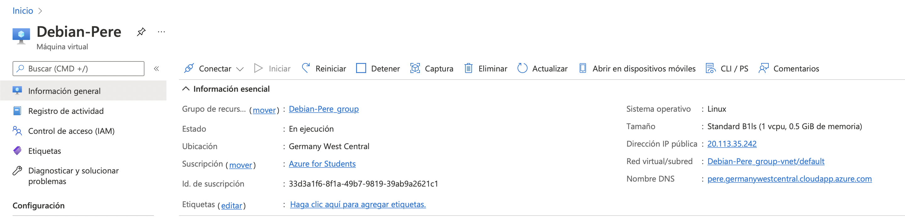
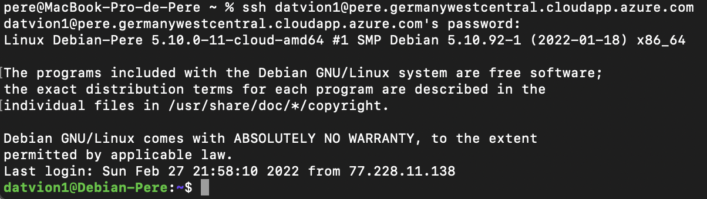
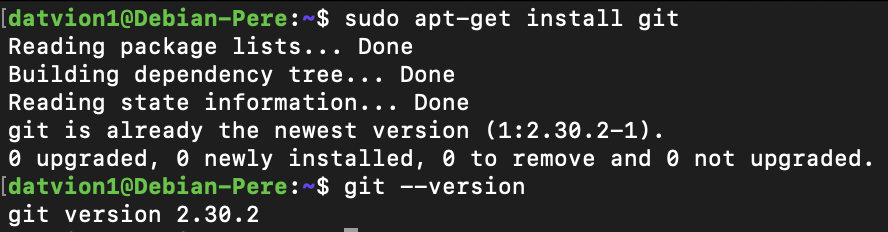
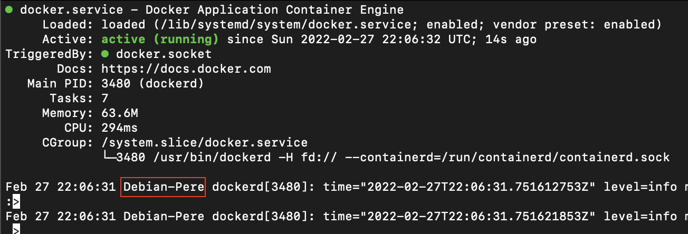
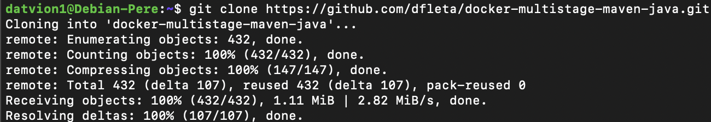
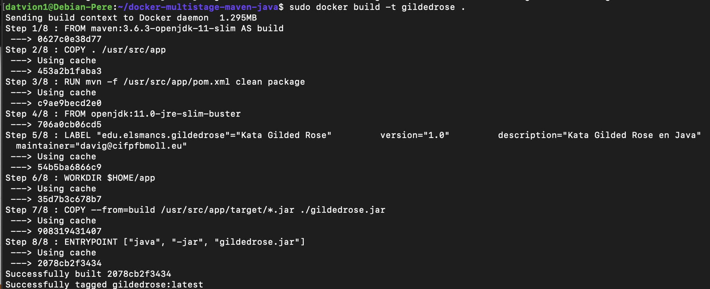
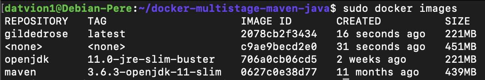
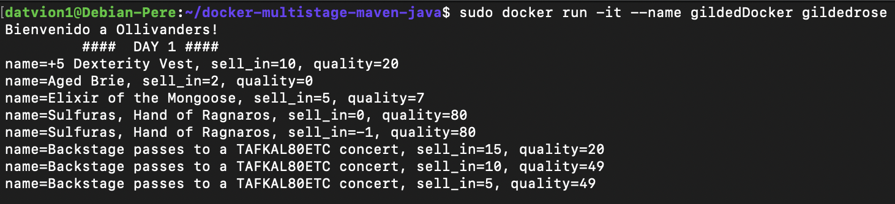
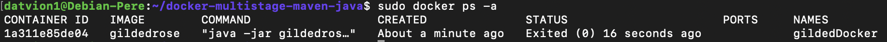

# Dockerized Gilded Rose en una VM de Microsoft Azure

### Pasos a seguir:

1. Crear la VM.
2. Conectarse a la VM (en este caso, por ssh)
3. Instalar la paquetería necesaria en la VM (no ha resultado ser necesario)
4. Instalar Git
5. Instalar Docker (https://www.digitalocean.com/community/tutorials/how-to-install-and-use-docker-on-ubuntu-20-04-es)
6. Dockerizar GildedRose.

---

#### 1. Crear la VM

En Azure, existe la opción de alquilar máquinas virtuales, por lo tanto, según los pasos explicados en clase, esta es la máquina virtual que usaré para realizar el ejercicio (instalado el SO de Debian):

---

#### 2. Conectarse a la VM

Me he conectado a la máquina virtual mediante SSH:

---

#### 3. Instalar la paquetería necesaria en la VM

---

#### 4. Instalar Git

Para instalar Git, he usado [apt-get install git]:

---

#### 5. Instalar Docker

He seguido los pasos indicados en esta página -> [Instalar Docker](https://www.digitalocean.com/community/tutorials/how-to-install-and-use-docker-on-ubuntu-20-04-es)

Resumidamente, he seguido los pasos al detalle, aún que he tenido que instalar **gnupg** porque si no, no podía verificar la llave según indican los pasos.

---

#### 6. Dockerizar GildedRose

He clonado el repositorio de [dfleta](https://github.com/dfleta/docker-multistage-maven-java):

Seguidamente, creado una imagen a partir del Dockerfile:

Finalmente, he creado y ejecutado un contenedor a partir de la imagen:

